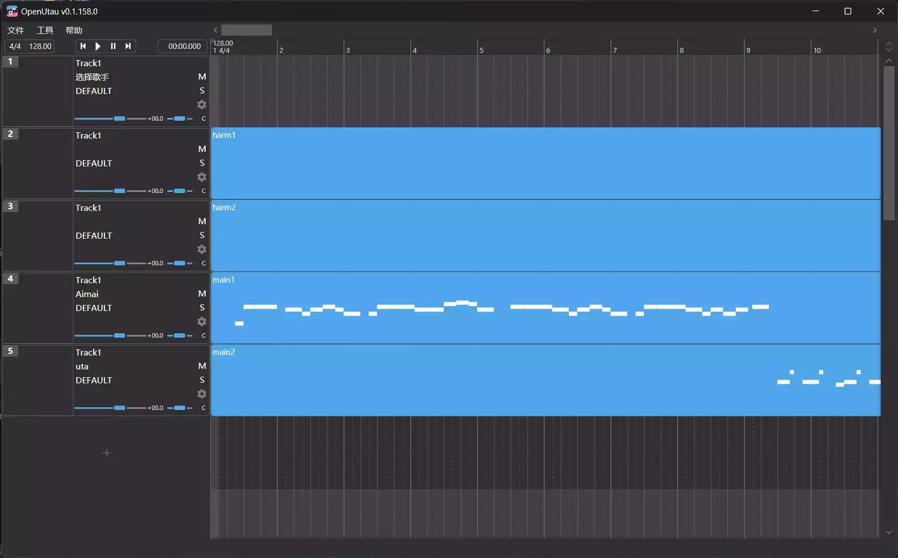
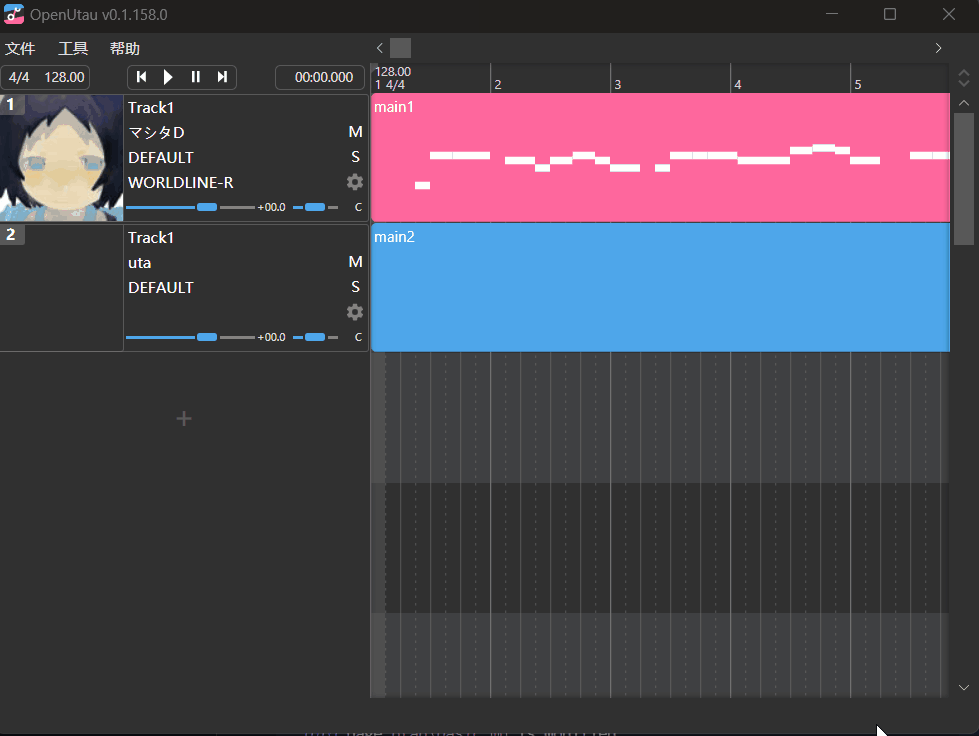
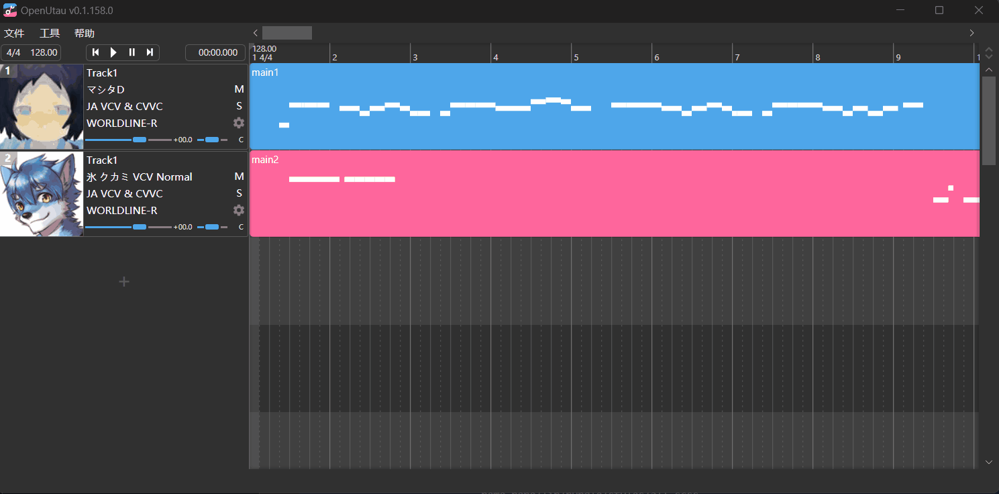

在上个章节中我们已经完成了OpenUtau的基本配置，现在是时候让我们来解决==主播我的Utau为什么发不出声的问题了==（误

## 主界面

::: tip
**详细介绍注意！！！**

这里会介绍主界面的各个元素的作用，虽然个人来讲比较建议你都了解一下再上手，但是如果你觉得你完全看一眼就知道这些要怎么用，那你完全可以直接跳到下面的[开始调声！](#开始调声！)部分。

~~毕竟这个部分确实稍微有些长~~
:::

在打开OpenUtau后，首先进入的页面。

### 顶栏

我们首先从顶栏开始介绍。

**顶栏**主要承载了一些文件相关的操作以及和软件本身有关的操作。

点选 **文件 --> 新建** 即可新建一个空白工程。

除了常用的新建、打开、保存等文件操作以外，工程、音频以及midi文件的导入导出也在这里完成。

作为示例，如果你需要导入多个ust工程到多个轨道上，你应该点击 **文件 --> 导入轨道** ，然后在打开的新窗口中选中**所有**你需要的ust工程。

点击打开后，音轨会被加入到工程的最下方。

**工具**选项卡中包含了一些比较常用的功能，如**自动排列窗口**。

**清除缓存功能**会把OpenUtau产生的所有合成缓存都删除掉，这有助于减少存储的占用并且有时候可能可以解决一些合成音频失败的问题（这个缓存不包含Moresampler和TIPS等建模类引擎生成的模型文件，请放心使用）。

另外，值得一提的是，OpenUtau自带了**歌手管理**工具，通过 **工具 --> 歌手** 即可打开。

~~当然如果你只是刚刚打算入门的萌新那么你也可以看过了事，以后也许也会有看懂并且用到这里的东西的一天的XD~~

### 控件栏

可以在这个控件栏中设置工程的**曲速**和**节拍**（当然也可以在右边的音轨器中设置曲速和节拍标记）

::: info 曲速和节拍
**BPM**即Beats Per Minutes，每分钟节拍数

工程的BPM一般和你的乐曲的BPM设置成**相同**或者倍数关系。

而**节拍**则是指工程的每小节有几拍（4/4即每小节4拍，每个音符的单位为四分之一拍）

如果你不知道你需要调声的音频的BPM，你可以使用这个工具进行测量 --> [Vocalremover](https://vocalremover.org/zh/key-bpm-finder)

这个工具网页也可以用来给提取音频中的干声和伴奏，建议收藏~
:::

### 侧边栏（音轨管理）

侧栏主要显示对应音轨上的**声库信息**，包括最左侧的声库头图、音轨名、选用的声库、使用的声码器、引擎设置、音量滑条及播放控制。

在侧栏中**点击声库名称**即可展开声库列表，可以在这里选择切换你已经安装过的声库。

::: note 注
如果你现在就想开始安装声库，可以跳到[#安装声库](#安装声库)
:::

**点击声码器名称**即可展开声码器列表（默认为DEFAULT，会自动根据声库设置切换声码器，如果你发现默认的声码器没有办法正常渲染声音可以在这里切换声码器。）

::: info 声码器的选择
不同的声码器接受的音符名称格式和音源是不一样的，一般推荐对日语VCV和CVVC声库使用这里的 <u>JA VCV&CVVC</u> 声码器，这个声码器可以同时接受输入あえいおうアエイオウ这样的假名，也可以输入aeiou这样的罗马音，可以有效防止==发不出声==这个问题的出现XD
:::

**点击引擎分类**可以切换内置的**WORLDLINE-R引擎**和**CLASSIC引擎**（即<u>和Utau相同的基于重采样器和合成器的构造的引擎组合</u>）而右边的小齿轮可以打开当前引擎的引擎设置界面。

::: note 注
如果使用WORLDLINE-R引擎那么小齿轮里应该不会有任何可配置项。

而使用CLASSIC引擎（如Moresampler，TIPS，doppeltler64等Utau引擎）时需要在这里配置重采样器和合成器，详见[引擎设置](/utau/resampler)
:::

下面的两个小滑条分别是**音量滑条**和**声像滑条**，前者可以调整预览的音量大小（不影响单独输出的音频的音量大小，但是使用OpenUtau自带的混缩功能则会生效），而声像滑条可以调整声音的声像（即**左右声道位置**，往左拉满会使声像出现在左侧90度直角方位，另一侧同理）

右侧的M和S按钮分别表示**Mute（静音）**和**Solo（独奏）**~~真的不是SM~~，分别会使这个轨道消音以及只播放这个轨道。（被设置静音的声轨即使单独输出音频也不会被输出，请注意）

### 播放界面

右侧的窗口就是OpenUtau的播放界面，会显示每个声轨的音符预览，**播放标记**和**小节号**会显示在顶部，同时在顶部的最左侧会显示这个工程的**默认曲速**和**拍号设置**。
::: note 注
因为实际上来讲，给工程设置bpm和拍号时其实就是直接在工程的最开头加了个bpm和拍号标记。

你也可以手动在顶侧右键添加拍号和bpm标记，这样可以完成一些歌曲**变速**的操作。
:::

## 安装声库

OpenUtau有很多种安装声库的方法，你可以直接像Utau一样解压到Singers安装声库（但是这样就会容易<u>像Utau一样产生**编码问题**</u>，虽然你也可以直接在OpenUtau的歌手设置里**修改编码格式**来解决，但是终究是不够方便）

对于OpenUtau，我们更推荐使用**拖放**的方法安装，你只需要把声库（.zip, .uar, .rar, etc.）直接拖放到OpenUtau的页面中就会自动启动安装程序。

在通过这种方法安装声库时，你可以设置声库的oto和配置文件的编码格式，使其可以被正确显示，然后OpenUtau会自动对声库进行转码，可以有效解决乱码和不识别的问题。

你也可以在 **工具 --> 安装歌手** 里直接选中声库文件来进行安装，步骤同上。

::: info Utau缘何产生编码问题？
由于Utau诞生于上个互联网时代（2009年）并且使用Virtual Basic语言编写，它**完全没有**为不同的编码环境做设计（那个时代的私人共享软件传播一般不会直接考虑到这种世界范围的分发。）而日本的计算机和其他区域不同，全部使用日本规定的**Shift-JIS**编码（国内现在的计算机环境一般是把GB2312编码成UTF8，所以大部分情况下不会出现这么严重的编码问题。），导致在非日本地区的计算机上会产生大量的乱码错误。

所以解决编码问题的关键主要在于把Utau放入一个Shift-JIS的环境或者直接把Utau的字符替换成UTF-8的编码，这也是前些年主要的解决方案。

当然OpenUtau直接就是为了现代计算机设计的，自然也没有这个问题，但是仍然需要为各种各样的声库准备转码功能。
:::