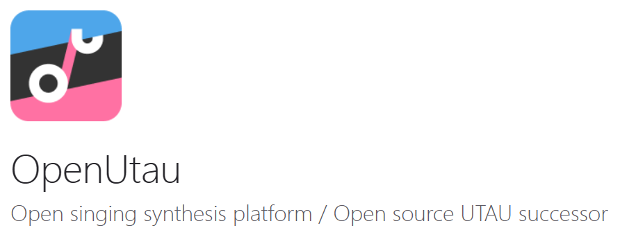

::: tip
当前版本的教程更新于： 2023年11月23日

这并不是严谨的文档，更多只是个人对一些踩过的坑的经验之谈，也方便更多喜欢这些东西想要参与进创作的同志们能够少走一些弯路
:::
::: note 编者注
这系列文档的内容并非编者独创，相反，它们大多来源于社群中的其他文章作者和p主们的贡献，编者更多只是起到了整理的作用，当然也塞进去了一些个人的见解和经验，希望这些内容能够对后来者有所帮助，也希望后来者能继续将这份来自社群的互联网精神传递下去，为其他人分享经验，提供帮助。

[所有被引用的社群文章 -- >](/utau/from)
:::

## 一些在开始之前的提醒

- 请务必记住，互联网是你最好的老师，许多东西都可以在网上找到答案，懂得提取关键词和检索信息的艺术也是网络生活的一部分。

- 多看看别人的调声晒有时候会学到很多有意思的手法。

- 多尝试点不一样的东西总是好的。

- 不要害怕把自己的作品发给别人看，也不要被别人的赞扬或贬低评论冲昏头脑，始终坚持提升自己的审美能力和技术水平总是好的。

## 环境准备

- 请确保你的设备属于`Windows`, `Linux`, `MacOS`这三种操作系统中的一种，操作系统会影响后续编辑器的选择。

- 不提倡使用Win7及之前的系统，不建议在`Linux`和`MacOS`上进行后续的操作。

::: info Why?
虽然如 **OpenUtau** 这样的编辑器是跨平台可用的，但许多采样器和合成器是面向Windows环境设计的，在Unix Like的系统上运行需要进行Wine的配置，而这一步相当繁琐并且可能产生意想不到的问题，而且并没有太多的资料可供查询，很可能需要你手动进行排障。
:::

## 选择编辑器

Utau是一个事实上**前后端分离**（即用户所见并使用的**编辑器**和负责处理音频的**采样器**相互独立且完全模块化）并且有相应的实现规范的项目，所以用户可以自由选用不同的前端编辑器进行使用。

目前主流的编辑器主要有以下两种：

### **OpenUtau**

由<u>Stakira</u> 及 <u>OpenUtau社区</u> 开发的**兼容Utau生态**并且致力于对未来的音声合成工具提供**标准化平台**的**开源**项目。

使用.NET Core和Avalonia框架开发，兼容`Windows`, `Linux`, `MacOS`平台。

作为近些年的后起之秀，OpenUtau很好的解决了Utau编辑器的一部分痛点，例如**字符编码难题**，对高版本系统的**兼容问题**等，同时附带了大量原本由插件才能实现的便捷编辑功能，但是由于跟Utau本体编辑器的很多接口不同，会导致一部分原有的插件无法使用。（~~当然，插件不能用很多时候可能主要还是编码问题......~~）

拥有更现代化的页面，同时提供了优秀的多轨非线性编辑功能，可以同时使用多个声库，同时也是Diffsinger，Vogen，NNSVS等神经网络音声合成技术的推荐兼容平台。

本篇文档将会主要基于==OpenUtau编辑器==进行编写。

~~但是自带的世界线引擎音质真的很差劲（~~

### **Utau**

::: tip
utau即日语中 **唄う** 的罗马音，意为歌唱，非常言简意赅XD
:::

由 <u>饴屋P</u> 开发的**Utau默认编辑器**，最早发布于2008年，使用Virtual Basic语言编写，是最早同时也最成熟的编辑器，也是这一生态的开创者。

受限于当时的技术，Utau编辑器在当代设备上有非常多影响体验的缺陷，尤其是令人烦躁又反复出现的编码错误，同时Utau对Windows 10之后的系统兼容性相对较差，可能会出现难以预料的问题。

由于使用早期的VB生态开发，Utau本身**仅支持Windows**，但是作为这个生态的活化石，在配置好之后可以有比较优秀的插件使用体验。

尽管Utau本体编辑器的开发在2013年就已经停滞，但是饴屋P在此后依然在为Utau开发新的采样器和合成器，在以后讲解采样器和合成器的文中会有所提及。

由于Utau年事已高，**在现代设备上的体验较差**，所以本篇文档不会以Utau作为主要编辑器，但是Utau仍有相当多的p主在使用，并且有丰富的资料和插件可用，你仍然可以将其作为自己的主力编辑器使用，不同的编辑器并不会对渲染出的音频产生直接影响，且它们的使用方法和思路是相通的。

如果你需要使用Utau，那么我建议你使用 [@至精至简](https://space.bilibili.com/87172593/) 制作的中文汉化整合版，可以跳过很多麻烦的问题。

[指路 -- >](https://www.bilibili.com/read/cv7974422/)
