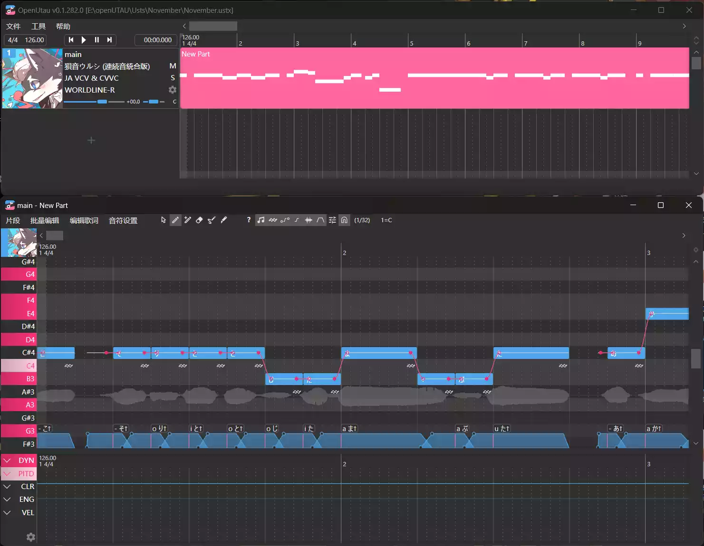

::: note 注
本篇文档主要演示在`Windows`系统下的安装和配置过程，对于Linux用户，你应当知道如何使用Github Release上的Linux预编译版本。
MacOS我也想讲，奈何买不起Mac（泪目）
:::
::: info
截止本篇文档最后一次被编辑时的OpenUtau正式发行版本为 [V0.1.327](https://github.com/stakira/OpenUtau/releases/tag/build%2F0.1.327) Release。尽管不同版本的操作一般并不会有什么太大的区别，但我仍然建议你优先根据实际情况进行操作。

如果一直没有跟进版本那么欢迎评论区催更~
:::

## 下载及安装

OpenUtau是一款免费开源的共享软件，你可以直接在[官网](http://www.openutau.com/)或者[Github Release](https://github.com/stakira/OpenUtau/releases)下载到最新的版本。

::: tip
一般来讲，你应该选择`*Windows X64*`对应的下载项。

很显然，2023年了，你的电子产品都是64位的。
:::
::: note 注
由于一些一言难尽的原因，直接通过官网或者release下载安装程序有时候速度会相当悲惨。

如果你在尝试过使用多线程下载器等方式后仍然不能正常的进行下载，我也提供了**云盘版本**。

云盘版本可能会无法马上跟进每次更新，当前云盘版本为0.1.327。

-- > [123网盘](https://www.123pan.com/s/GTS0Vv-EpHod.html)
:::

一般来讲，在从官网下载之后，你会得到一个`OpenUtau-win-x64.zip`，直接在你喜欢的地方解压即可。（如果下载的是exe版本只需要把安装程序正常走完即可，然后你可以跳过下面这段文字）。

且慢，虽然说OpenUtau本身可以在任何系统编码的路径下正常运行，但是引擎（即一般我们讲的合成器和重采样器）以及你可能会需要用到的非自带的插件，不一定可以正常在**中文编码**的路径下运行，所以我仍然建议你把OpenUtau解压在一个<u>完全由英文数字以及可用的半角符号</u>构成的路径里（如`D:/OpenUtau-release/`这样的路径）

解压完成后的文件夹应当是这样的：

恭喜你！你已经完成了OpenUtau的安装。现在，打开OpenUtau.exe，开始你的跳绳之路吧（~~误~~

## 初始配置

在完成安装之后，我们双击打开OpenUtau。

如果你的OpenUtau没有安装在固态硬盘里，那么视你安装的插件和声库的多少，它的启动速度可能会有些偏慢，如果一直没见窗口出现，那么饮茶先啦。

第一次启动OpenUtau时，它的窗口一般是这样的。

为了避免出现 `啊主播我的OpenUtau怎么发不出声音啊` 之类的~~传世经典~~状况，在开始我们的跳绳Time之前，我们需要对OpenUtau进行一些配置。

点击 工具 --> 使用偏好 即可打开OpenUtau的设置界面。

使用偏好中有几个设置项目的分类，我们在这里分别进行讲解。

::: tip
配置的部分很长很无聊，你可以先自己看看里面的配置，大多其实你一眼就能看出来要怎么使用，如果有什么不明白的再看下文里的内容对着找，如果没有问题那么你可以直接跳过下面的配置部分去看[基础操作](/utau/basic)。
:::

### 回放

这个分类中主要是设置音频的播放相关的设置。

**回放设备**即你需要用来预览渲染之后的音频的设备，对于一般没有外接扬声器的设备来讲，这里只会有一个可选项（也就是你的设备**默认自带的扬声器**）；如果你的电脑上有多个外接的播放设备或者有一些虚拟播放设备（有些声卡会生成这个），那么请手动选择到你需要使用的播放设备上。你可以通过下面的**测试按钮**来判断这是不是你需要使用的设备，它会在对应的设备上播放一段嗡嗡嗡的噪声。

**音频后端**选项一般不需要配置，OpenUtau会自动配置到PortAudio上（也只内置了这一种后端），这是用来实现音频的录制播放等功能的工具库。

**暂停时**选项中有两个可选项，默认的`什么都不做`和可选的`将播放标记移回开始播放处`，这两个选项的区别在于，后者会使你预览一段音频之后**让光标回到预览开始的位置**，而前者不会。这和一些DAW软件的操作风格相似（如Au），你可以根据自己的喜好来选择这个功能。

**自动滚动**选项下分为三个选项，`关`（也就是不使用自动滚动），`固定播放标记`和`整页滚动`。

如果你关闭自动滚动，那么当播放标记超出了当前编辑器正在显示的范围时，编辑器不会有任何操作。

如果你使用固定播放标记，播放标记会自动固定在编辑器的一个位置上，然后播放时编辑器会自动滑动来显示当前正在播放的音符（这个功能常被用于制作调声晒）。

如果你使用整页滚动，那么播放标记超出正在显示的范围时，编辑器会自动滑动一页的距离使播放标记回到到编辑器的最左侧。

如果你启用了`固定播放标记`选项，那么你可以通过下面的`自动滚动边界`滑条来设置播放标记会被固定在什么位置。（滑条的数值即为播放标记会被固定在编辑器从左到右百分比的位置，例如默认的0.9就是会被固定在界面宽度从左到右90%的位置）

### 路径

默认来讲，声库会在安装后被放在OpenUtau的**Singers**文件夹中，但是你也可以在这里设置额外的路径，OpenUtau也会在启动时读取这个路径中的声库（例如你的电脑上已经安装过Utau并且在Utau中设置过声库，你就可以把这个路径设置成Utau的声库路径，就可以和Utau共用声库了）。

其下的安装至`额外歌手路径`这一选项，用于配置是否会把新安装的声库（使用OpenUtau的拖放来进行安装或者安装歌手来进行安装）安装到上面设置的路径里，如果上面的额外路径没有配置那么不论这个选项是否有配置过都会直接安装在Singers文件夹中，这个选项的默认值是`开`，但是如果你没有<u>把声库安装外置的需求或者不需要和Utau共享声库文件夹</u>，那么我其实建议你把这个选项关闭（~~虽然具体关不关其实并没有什么意义，因为你设置了大概率就是想要用来外置声库~~）

### 渲染

**预渲染**这一选项主要控制是否进行预渲染，也就是在你不进行预览播放时是否提前渲染音频，如果启用这个选项（默认选项）那么编辑器会自动在你不进行播放的时候渲染所有轨道的音频，且你的每次操作之后也都会自动渲染音频。而关闭这个选项后则是只会在你预览音频时才进行渲染（类似于原本的Utau）。

::: note 注
开启预渲染会在很大程度上让你的调声体验更加丝滑，但是这是建立在你使用的设备**有充足的CPU资源的前提下**，对于笔记本设备（尤其是轻薄本）这个选项会严重增大设备的负担并导致卡顿，所以对于设备性能并不理想的用户们我尤其建议关闭这一选项。

如果你使用Moresampler或者TIPS这类本身比较大的建模类引擎，它们天然就稍慢一些的渲染速度会在开启这一选项后让你痛不欲生（

~~跳绳一分钟，渲染两小时~~
:::

**Maximum Render Threads**即**最大渲染线程**，这个值控制渲染的线程数（如果你使用过Utau的话，那么Utau里每次进行渲染时的一个窗口就对应这里的一个线程。），默认值为2，即渲染时会同时使用两个线程，OpenUtau会自动在运行时对需要渲染的工程进行拆分并同时使用多个引擎进程来进行渲染，升高这个值可以有效的提升渲染的速度，但是也会消耗更多的性能和内存，实际上，将这个值设置的太大反而会产生反作用导致运行缓慢。一般建议视自己电脑的性能水平设置在2-6之间。

下面的两个选项仅在使用**神经网络模型**（Vogen，NNSVS，Diffsinger，etc.）时具有实际作用，如需要使用可作为参考。

机器学习运行器有`cpu`和`directml`两个选项，选择cpu即使用电脑的CPU进行渲染，而directml则可以支持使用GPU进行加速运算，如果你有一张Nvidia/AMD/Intel的显卡请务必使用DirectML来进行推理，否则会浪费大量的时间（因为cpu推理真的很慢！！！）

如果你启用了DirectML作为机器学习运行器，那么你需要在下面将用于计算的GPU指定为你需要的GPU。

### 外观

这个选项卡主要用于配置一些界面显示相关的设置。

**语言选项**很显然就是配置界面的显示语言，OpenUtau作为开源软件有着八国联军级别的语言适配。（确信）

**歌手排序方式**主要影响在歌手列表里歌手的排序方式，配置为中文则会以中文拼音的顺序来进行排序。

**主题选项**则是控制OpenUtau界面的亮暗主题（白黑）。

**在钢琴窗上显示歌手背景图**这一选项则是设置是否在OpenUtau的界面上叠加显示一个在声库中预先配置的背景图（常用于录制调声晒）。

Show other tracks' notes on piano roll（是否显示其他音轨上的音符）这一选项主要是设置是否显示一个其他音轨上的音符的叠加层（类似一些DAW的功能）

### Oto Editor

（暂时推迟）

### 高级

（暂时推迟）