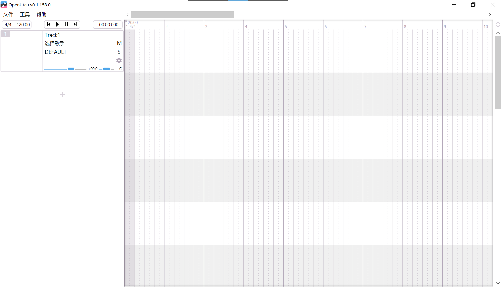
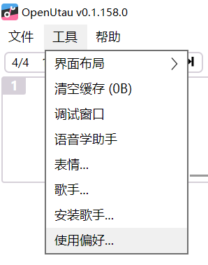

::: note 注
本篇文档主要演示在`Windows`系统下的安装和配置过程，对于Linux用户，你应当知道如何使用Github Release上的Linux预编译版本。
MacOS我也想讲，奈何买不起Mac（泪目）
:::
::: info
截止本篇文档最后一次被编辑时的OpenUtau正式发行版本为 [V0.1.158](https://github.com/stakira/OpenUtau/releases/tag/build%2F0.1.158) Release。尽管不同版本的操作一般并不会有什么太大的区别，但我仍然建议你优先根据实际情况进行操作。

如果一直没有跟进版本那么欢迎评论区催更~
:::

## 下载及安装

OpenUtau是一款免费开源的共享软件，你可以直接在[官网](http://www.openutau.com/)或者[Github Release](https://github.com/stakira/OpenUtau/releases)下载到最新的版本。

::: tip
一般来讲，你应该选择`*Windows X64*`对应的下载项。

很显然，2023年了，你的电子产品都是64位的。
:::
::: note 注
由于一些一言难尽的原因，直接通过官网或者release下载安装程序有时候速度会相当悲惨。

如果你在尝试过使用多线程下载器等方式后仍然不能正常的进行下载，我也提供了**云盘版本**。

云盘版本可能会无法马上跟进每次更新，当前云盘版本为0.1.158。

-- > [123网盘](https://www.123pan.com/s/GTS0Vv-EpHod.html)
:::

一般来讲，在从官网下载之后，你会得到一个`OpenUtau-win-x64.zip`，直接在你喜欢的地方解压即可。（如果下载的是exe版本只需要把安装程序正常走完即可，然后你可以跳过下面这段文字）。

且慢，虽然说OpenUtau本身可以在任何系统编码的路径下正常运行，但是引擎（即一般我们讲的合成器和重采样器）以及你可能会需要用到的非自带的插件，不一定可以正常在**中文编码**的路径下运行，所以我仍然建议你把OpenUtau解压在一个<u>完全由英文数字以及可用的半角符号</u>构成的路径里（如`D:/OpenUtau-release/`这样的路径）

解压完成后的文件夹应当是这样的：

恭喜你！你已经完成了OpenUtau的安装。现在，打开OpenUtau.exe，开始你的跳绳之路吧（~~误~~

## 初始配置

在完成安装之后，我们双击打开OpenUtau。

如果你的OpenUtau没有安装在固态硬盘里，那么视你安装的插件和声库的多少，它的启动速度可能会有些偏慢，如果一直没见窗口出现，那么饮茶先啦。

第一次启动OpenUtau时，它的窗口一般是这样的。

为了避免出现 `啊主播我的OpenUtau怎么发不出声音啊` 之类的~~传世经典~~状况，在开始我们的跳绳Time之前，我们需要对OpenUtau进行一些配置。

点击 工具 --> 使用偏好 即可打开OpenUtau的设置界面。

使用偏好中有几个设置项目的分类，我们在这里分别进行讲解。

::: tip
配置的部分很长很无聊，你可以先自己看看里面的配置，大多其实你一眼就能看出来要怎么使用，如果有什么不明白的再看下文里的内容对着找，如果没有问题那么你可以直接跳过下面的配置部分去看基础操作。
:::

### 回放

这个分类中主要是设置音频的播放相关的设置。

**回放设备**即你需要用来预览渲染之后的音频的设备，对于一般没有外接扬声器的设备来讲，这里只会有一个可选项（也就是你的设备**默认自带的扬声器**）；如果你的电脑上有多个外接的播放设备或者有一些虚拟播放设备（有些声卡会生成这个），那么请手动选择到你需要使用的播放设备上。你可以通过下面的**测试按钮**来判断这是不是你需要使用的设备，它会在对应的设备上播放一段嗡嗡嗡的噪声。

**音频后端**选项一般不需要配置，OpenUtau会自动配置到PortAudio上（也只内置了这一种后端），这是用来实现音频的录制播放等功能的工具库。

**暂停时**选项中有两个可选项，默认的`什么都不做`和可选的`将播放标记移回开始播放处`，这两个选项的区别在于，后者会使你预览一段音频之后**让光标回到预览开始的位置**，而前者不会。这和一些DAW软件的操作风格相似（如Au），你可以根据自己的喜好来选择这个功能。

**自动滚动**选项下分为三个选项，`关`（也就是不使用自动滚动），`固定播放标记`和`整页滚动`。

如果你关闭自动滚动，那么当播放标记超出了当前编辑器正在显示的范围时，编辑器不会有任何操作。

如果你使用固定播放标记，播放标记会自动固定在编辑器的一个位置上，然后播放时编辑器会自动滑动来显示当前正在播放的音符（这个功能常被用于制作调声晒）。

如果你使用整页滚动，那么播放标记超出正在显示的范围时，编辑器会自动滑动一页的距离使播放标记回到到编辑器的最左侧。

如果你启用了`固定播放标记`选项，那么你可以通过下面的`自动滚动边界`滑条来设置播放标记会被固定在什么位置。（滑条的数值即为播放标记会被固定在编辑器从左到右百分比的位置，例如默认的0.9就是会被固定在界面宽度从左到右90%的位置）

### 路径

### 渲染

### 外观

### Oto Editor

### 高级